

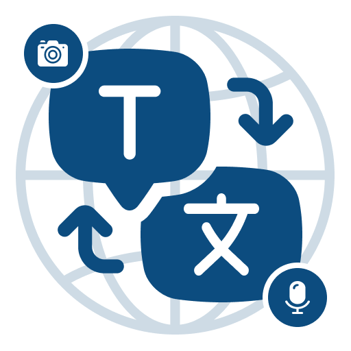

# Translotic: All Language Translator

**Speak your language, understand theirs.**
Translotic makes communication simple across **100+ languages**, with text, voice, camera, gallery and face-to-face translation in one app.

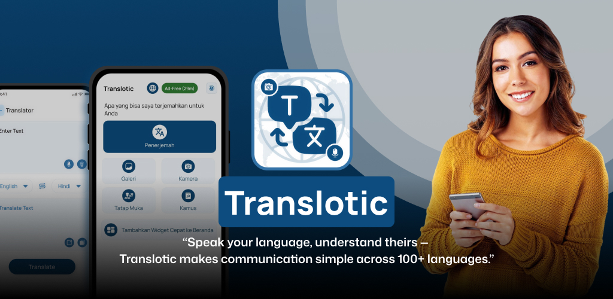

---

## 📌 Table of Contents

- [About](#-about)
- [What's New](#-whats-new)
- [Features](#-features)
- [Screenshots](#-screenshots)
- [UX Highlights](#-ux-highlights)
- [Design System](#-design-system)
- [Tech Stack](#%EF%B8%8F-tech-stack)
- [Roadmap](#-roadmap)
- [Team](#-team)
- [Contact](#-contact)

---

## 🌍 About

**Translotic** is an Android translator for travelers, students, business professionals and language learners. You can type, speak, snap a photo or pick an image from your gallery, and Translotic translates it into your chosen language right away.

> "Speak your language, understand theirs. Translotic makes communication simple across 100+ languages."

---

## 🆕 What's New

| Update | Description |
| :-- | :-- |
| 🎨 **Refreshed UI** | New brand identity: a deep-navy and sky-blue palette, soft rounded cards and a new globe-and-speech-bubble logo. |
| 🌐 **App language switcher** | Change the app's interface language from the globe icon on the home screen. The whole app is localized, not only the translations. |
| 🗣️ **Face-to-Face mode** | A split-screen conversation view. The top half is flipped so the person across the table can read it. |
| 🔤 **100+ languages** | A larger language list with a quick scrollable picker, from Afrikaans to Zulu. |
| ⏳ **Ad-free sessions** | Earn a timed ad-free session (for example, *Ad-Free 29m*), shown as a badge on the home screen. |
| 🧩 **Home-screen widget** | *Add Quick Widget to Home* opens translation with one tap from the launcher. |
| 🕘 **History** | Every translation is saved, with a confirm-before-delete dialog. |

---

## ✨ Features

<table>
<tr>
<td width="50%" valign="top">

### ✍️ Text Translator
Type or paste any text, pick the source and target languages, swap them with one tap and translate. You can **copy** or **share** the result.

### 🎤 Voice Translation
Tap the mic and speak. Translotic converts your speech to text and translates it right away.

### 📷 Camera Translation
Point your camera at signs, menus or documents to capture and translate the text (OCR).

</td>
<td width="50%" valign="top">

### 🖼️ Gallery Translation
Pick any image from your gallery, then rotate, flip and crop it before translating the text inside it.

### 🤝 Face-to-Face
Have a real-time conversation across a table. Each person gets their own half of the screen, language and mic.

### 📖 Dictionary
Look up any word by typing or speaking it. You get the **phonetics**, **part of speech** and **definition**.

</td>
</tr>
</table>

---

## 📸 Screenshots

### Store Highlights

  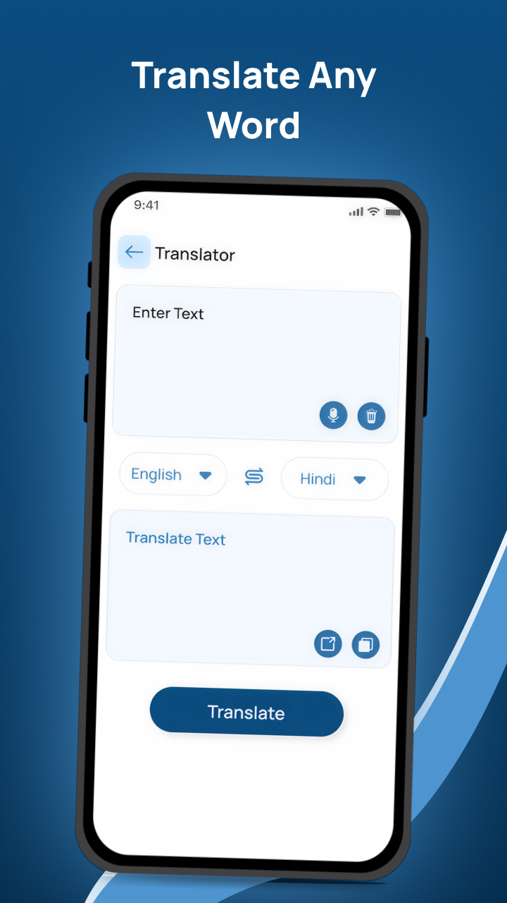
  &nbsp;
  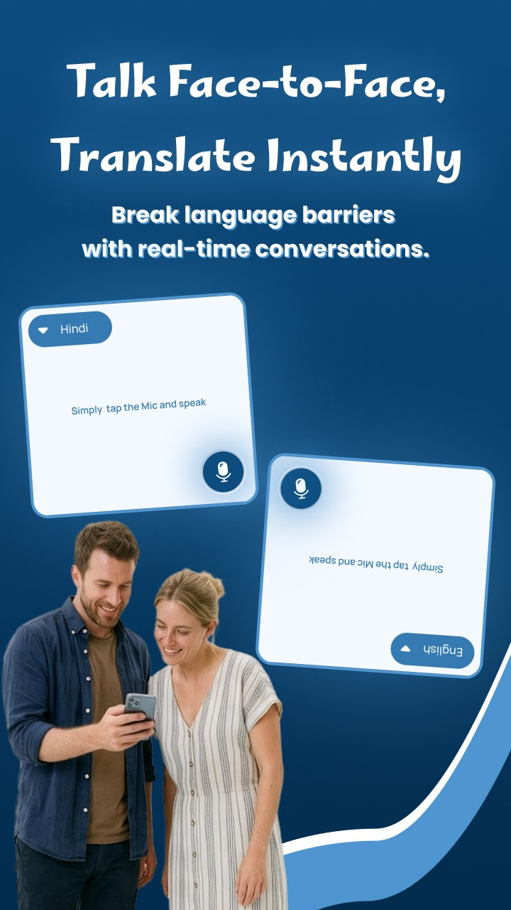
  &nbsp;
  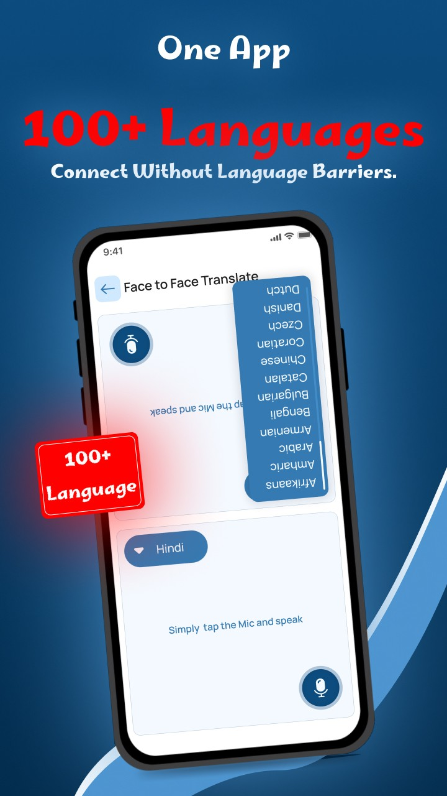

### App Screens

| Splash | Home | Translator | Gallery |
| :-: | :-: | :-: | :-: |
| 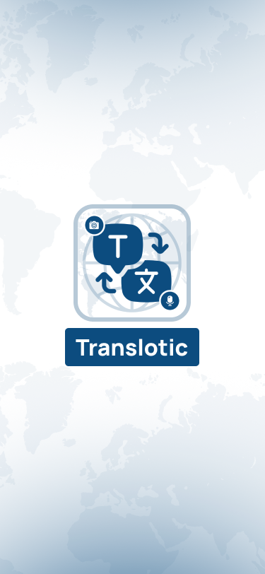 | 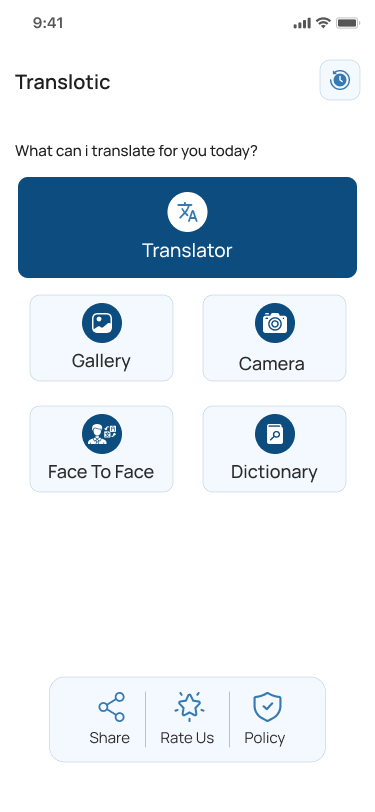 | 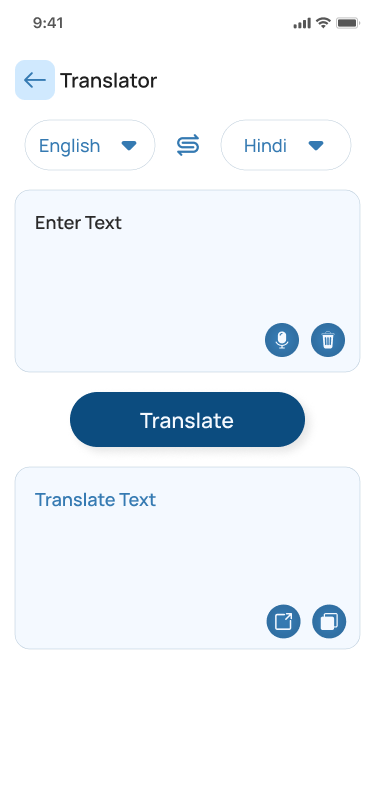 | 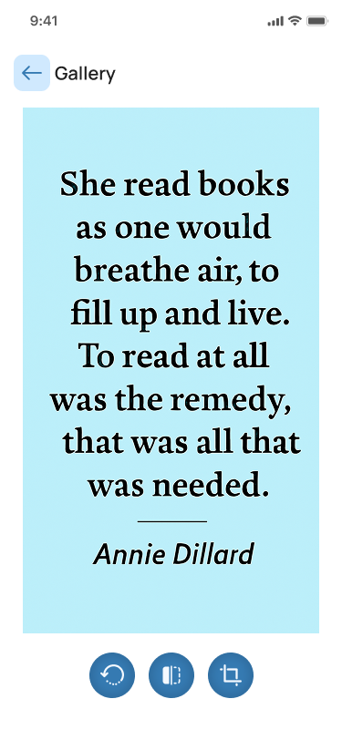 |

| Camera | Face-to-Face | Language Picker | Dictionary |
| :-: | :-: | :-: | :-: |
| 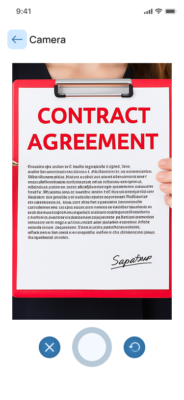 | 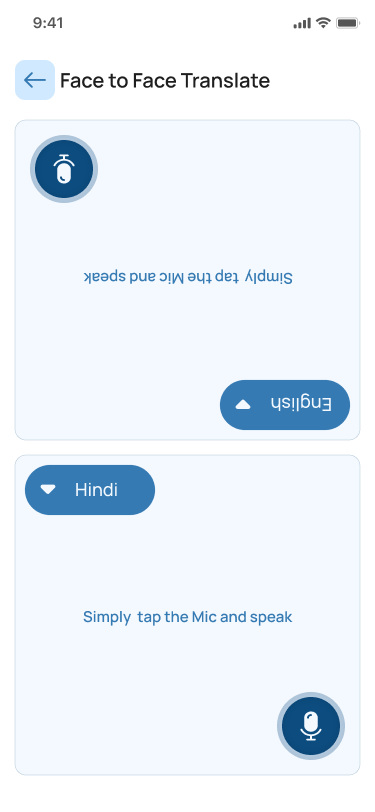 | 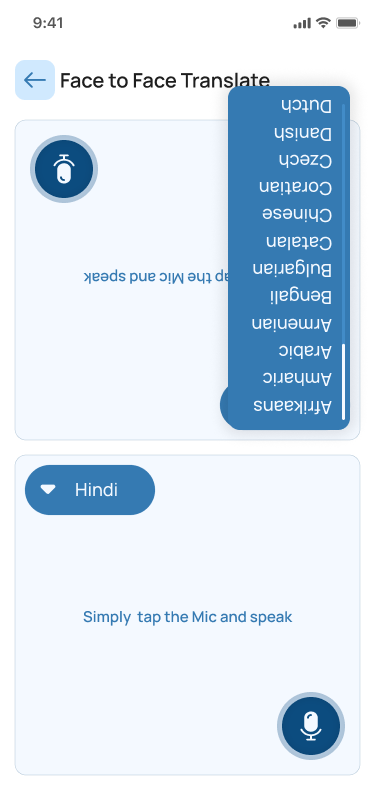 | 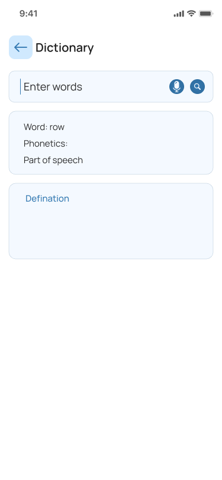 |

| Voice Search | History | Clear History |
| :-: | :-: | :-: |
| 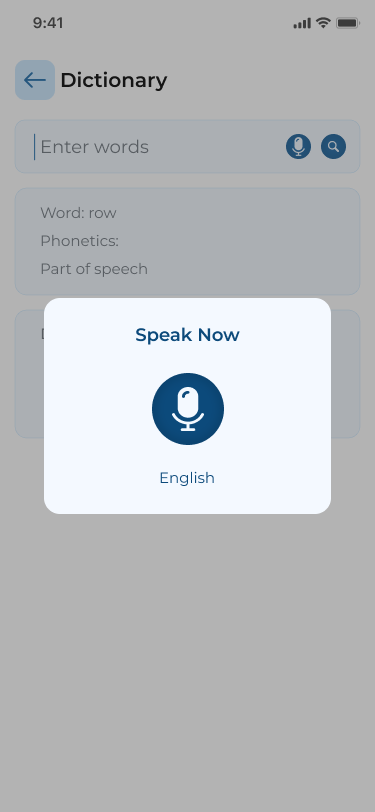 |  | 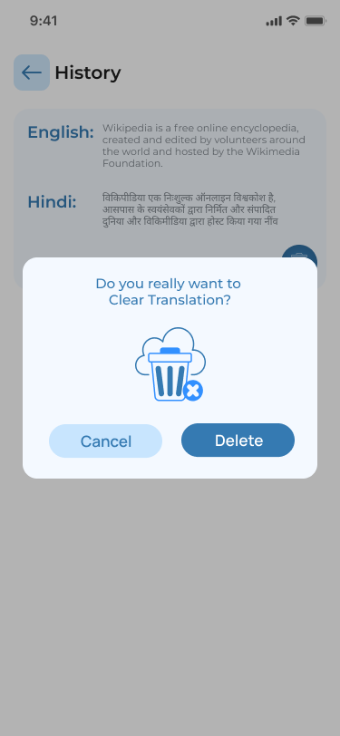 |

---

## 🧠 UX Highlights

- **One-tap home:** a large primary *Translator* card, with Gallery, Camera, Face-to-Face and Dictionary tiles in a 2×2 grid.
- **Flipped conversation layout:** in Face-to-Face mode the top panel is rotated 180°, so both people can read their side without passing the phone around.
- **Swap in one tap:** the ⇄ button swaps the source and target languages.
- **Voice everywhere:** mic buttons in the Translator, Dictionary and Face-to-Face screens, with a clear *Speak Now* prompt.
- **Safe actions:** deleting history always asks for confirmation.
- **Consistent controls:** round icon buttons for mic, clear, copy and share appear in the same place on every screen.
- **Localized UI:** the interface itself can run in the user's language (for example, Indonesian: *Penerjemah, Galeri, Kamera, Tatap Muka, Kamus*).

---

## 🎨 Design System

| Token | Color | Usage |
| :-- | :-- | :-- |
| Primary |  `#0C4C7F` | Buttons, icons, primary card |
| Accent |  `#4A90D0` | Language chips, links, highlights |
| Surface |  `#F4F9FF` | Input and output cards |
| Background |  `#FFFFFF` | Screen background |

**Typography:** Manrope (UI) · **Corners:** 12–16 px rounded cards and pill buttons · **Icons:** filled circular icon buttons

---

## 🛠️ Tech Stack

| Area | Tools |
| :-- | :-- |
| 📱 Mobile | Android · Java / Kotlin |
| 🎨 UI/UX | Figma · Material Design |
| 🔊 Voice | Speech-to-Text · Text-to-Speech |
| 🔍 Vision | Camera and Gallery OCR |

---

## 🚀 Roadmap

- [x] Text, voice, camera and gallery translation
- [x] Face-to-Face conversation mode
- [x] Dictionary with voice search
- [x] Translation history
- [x] 100+ languages
- [x] Localized app UI
- [x] Home-screen quick widget
- [ ] Offline translation packs
- [ ] AI-powered context-aware translation
- [ ] Dark mode

---

## 👩‍💻 Team

| Role | Name |
| :-- | :-- |
| Android Developer & UI/UX Designer | **Vaidehi Virani** |
| Team Member | Parth Kothiya |
| Team Member | Bhavin Mulani |

---

## 📫 Contact

📧 **Email:** [loveloop9055@gmail.com](mailto:loveloop9055@gmail.com)
📲 **Play Store:** [Translotic on Google Play](https://play.google.com/store/apps/details?id=com.translia.voice.translotic)

---

### ⭐ If you like Translotic, give this repo a star!

Made with 💙 for a world without language barriers.

